Terraform is a tool for building, changing, and versioning infrastructure safely and efficiently. You can provision load balancers on GCP efficiently with Terraform.

In this tutorial, we will provision load balancer by using GCP Terraform modules.

https://cloud.google.com/load-balancing/docs/


## Objectives

* Learn about the load balancing modules for Terraform.
* [Create a Regional Network TCP load balancer.](#regional-network-load-balancer)
* [Create a Regional Internal TCP load balancer.](#regional-internal-tcp-load-balancer)
* Create a Global HTTP Load Balancer with Kubernetes Engine.
* [Create a Global Content-based HTTP Load Balancer.](#global-https-content-based-load-balancer)


### Load Balancing modules for Terraform

A functional Load Balancer on GCP can be constructed by combining these elements
* Forwarding Rules
* Backend Services
* Target Pools
* URL maps
* Target Proxies

#### Changing Terraform version

We will use Terraform `v0.11.x` in this tutorial. If you have Terraform `v0.12.x` installed in your local environment or you use Cloud Shell (comes with Terraform `v0.12.x`), you should switch to Terraform `v0.11.x`.

If you have `tfswitch` installed in your environment, choose and switch to `v0.11.x` with this command:

```bash
tfswitch
```

Example Output:
```
Use the arrow keys to navigate: ↓ ↑ → ← 
? Select Terraform version: 
  ▸ 0.11.14 *recent
    0.12.3
    0.12.2
    0.12.1
↓   0.12.0
```

If `tfswitch` is not installed in your environment, install and configure `tfswitch` with these commands:

```bash
wget https://github.com/warrensbox/terraform-switcher/releases/download/0.7.737/terraform-switcher_0.7.737_linux_amd64.tar.gz
mkdir -p ${HOME}/bin
tar -xvf terraform-switcher_0.7.737_linux_amd64.tar.gz -C ${HOME}/bin
export PATH=$PATH:${HOME}/bin
tfswitch -b ${HOME}/bin/terraform 0.11.14
echo "0.11.14" >> .tfswitchrc
exit
```

The above command will terminate your shell connection. Open it again, then veify your Terraform version.

```bash
terraform version
```

Example Output:
```
Terraform v0.11.14
```


If you aren't using Cloud Shell, this tutorial uses the [default application credentials](https://cloud.google.com/docs/authentication/production) for Terraform authentication to GCP. Run the following command first to obtain the default credentials for your project.
```bash
gcloud auth application-default login
```


#### Set up the environment

In terminal, clone the terraform-gcp-lb repository:
```bash
git clone https://github.com/mertpaker/terraform-gcp-lb.git
```

Save the GCP Project ID in an environmental variable:
```bash
export GOOGLE_PROJECT=$(gcloud config get-value project)
```


## Regional Network Load Balancer

In this section, we will create a [Regional TCP Network Load Balancer](https://cloud.google.com/load-balancing/docs/network/) for regional load balancing across a managed instance group.

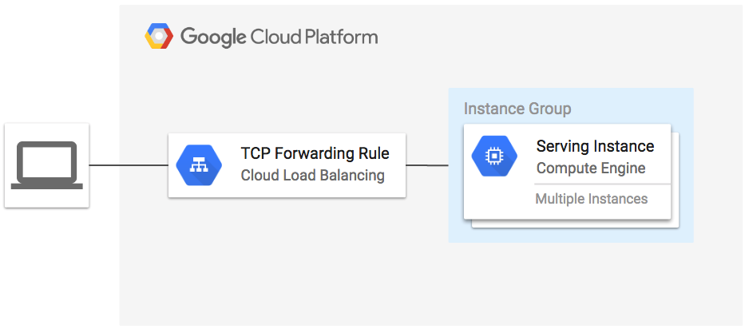

**Figure 1.** `regional-lb` architecture diagram

[Regional TCP Load Balancer Terraform Module](https://github.com/GoogleCloudPlatform/terraform-google-lb/tree/028dd3dc09ae1bf47e107ab435310c0a57b1674c) of GCP is used in this tutorial.

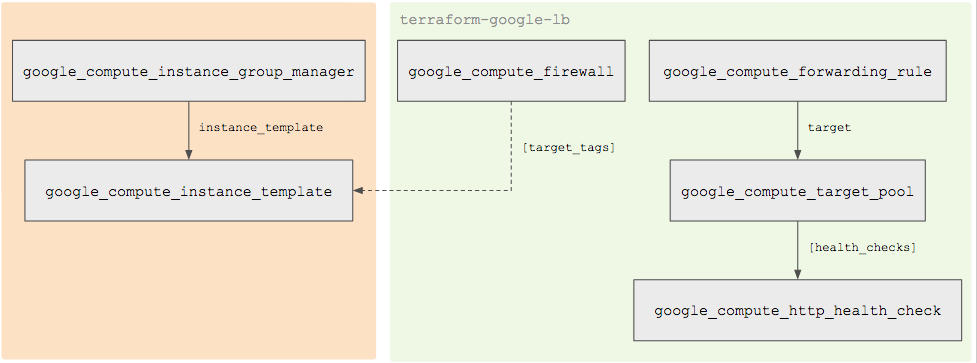
**Figure 2.** `terraform-google-lb` module Terraform resources diagram

* [google_compute_forwarding_rule.default](https://www.terraform.io/docs/providers/google/r/compute_forwarding_rule.html): TCP Forwarding rule to the service port on the instances.
* [google_compute_target_pool.default](https://www.terraform.io/docs/providers/google/r/compute_target_pool.html): The target pool created for the instance group.
* [google_compute_http_health_check.default](https://www.terraform.io/docs/providers/google/r/compute_http_health_check.html): The health check for the instance group targeted at the service port.
* [google_compute_firewall.default-lb-fw](https://www.terraform.io/docs/providers/google/r/compute_firewall.html): Firewall that allows traffic from anywhere to instances service port.

Enter into the tutorial directory.

```bash
cd example-lb
```

Initialize `Terraform`:

```bash
terraform init
```

```bash
terraform plan -out=tfplan
```

Example Output:
```
...

Plan: 10 to add, 0 to change, 0 to destroy.

------------------------------------------------------------------------

This plan was saved to: tfplan

To perform exactly these actions, run the following command to apply:
    terraform apply "tfplan"
```


```bash
terraform apply tfplan
```

Example Output:
```
Apply complete! Resources: 10 added, 0 changed, 0 destroyed.

Outputs:

load-balancer-ip = 104.155.179.34
```

The instances and load balancer are ready after a few minutes.

You can check the status of your load balancer in the GCP Console by navigating to **Navigation Menu > Networking Services > Load Balancing**.

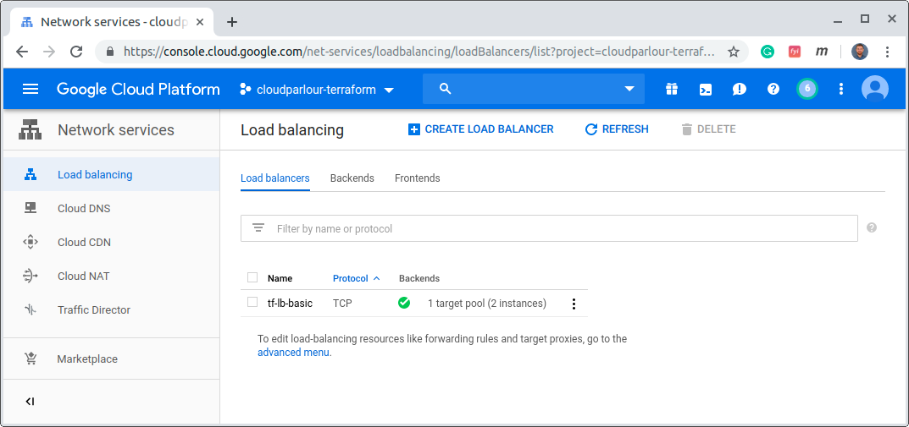

Click on **tf-lb-basic** load balancer and check the details.

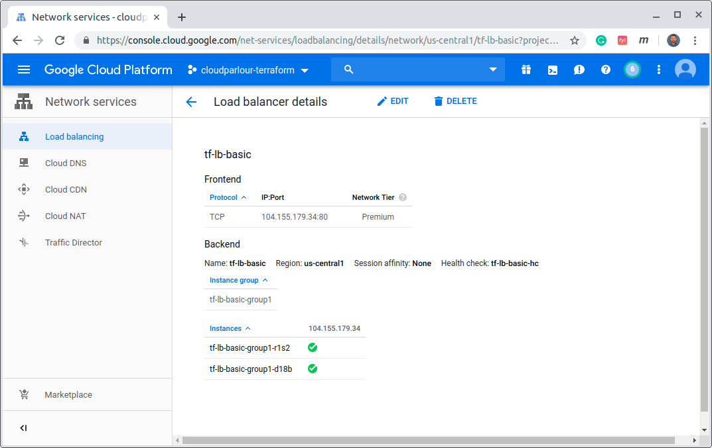

To be able to open the URL of the load balancer in a browser, run the following:

```bash
EXTERNAL_IP=$(terraform output | grep load-balancer-ip | cut -d = -f2 | xargs echo -n)
echo "http://${EXTERNAL_IP}"
```

Click on the `http://${EXTERNAL_IP}` address in the output to open the link to the load balancer.

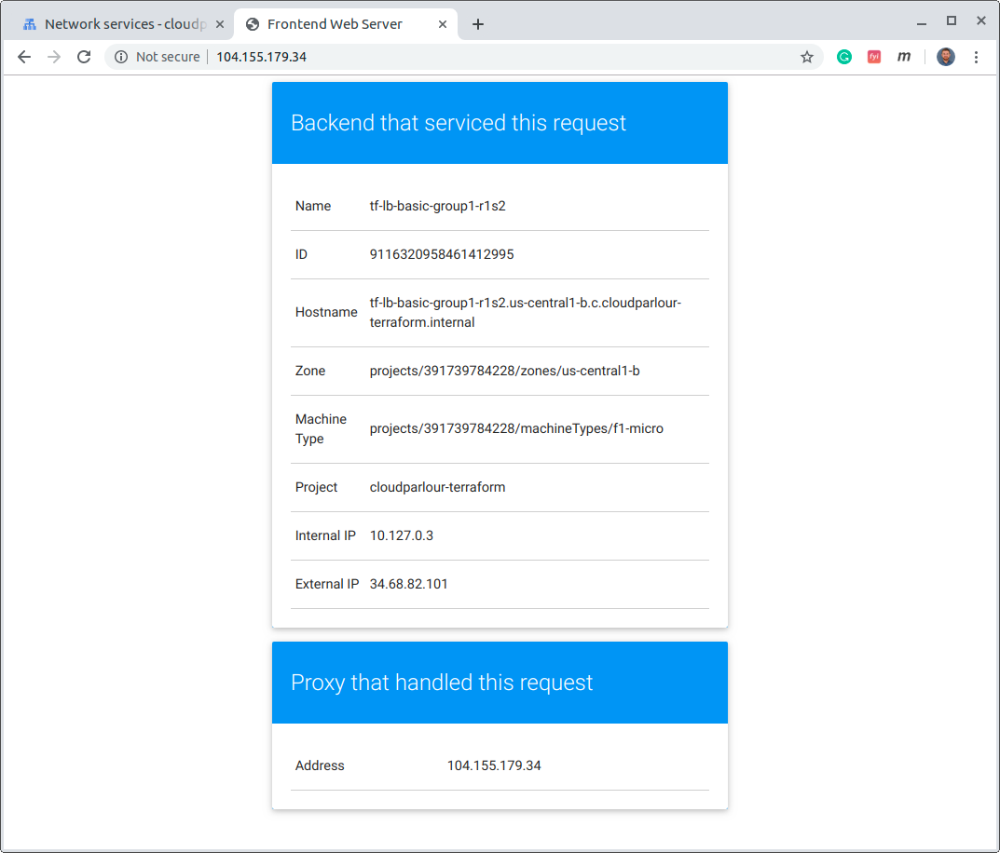

Refresh a few times to observe traffic being balanced across the two instances in the us-central1 region.

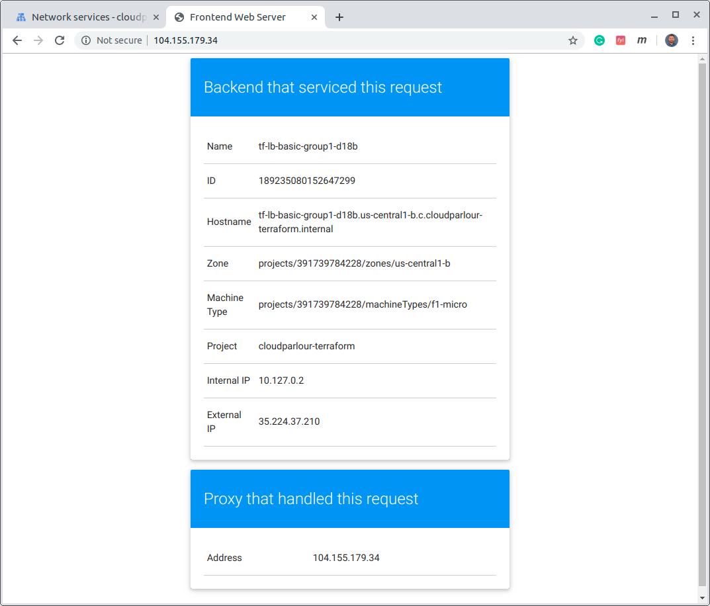

When finished, clean up the example by running `terraform destroy` and change back to the parent directory:

```bash
terraform destroy -auto-approve
cd ..

```

Example Output:
```
...

Destroy complete! Resources: 48 destroyed.

```


## Regional Internal TCP Load Balancer

In this section, we will create a [Regional Internal TCP Network Load Balancer](https://cloud.google.com/load-balancing/docs/internal/) for regional load balancing across a managed instance group.

This example creates three instance groups. The first group is in us-central1-b and uses the internal load balancer to proxy access to services running in instance groups two and three which exist in us-central1-c and us-central1-f respectively. A regional TCP load balancer is also used to forward external traffic to the instances in group one.

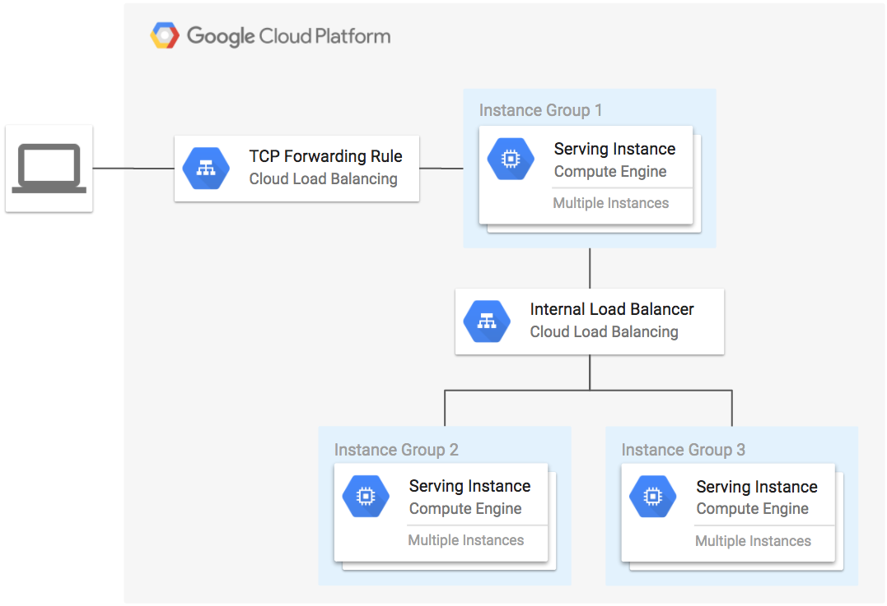
**Figure 1.** `regional-internal-lb` architecture diagram


`terraform-google-lb-internal` module Terraform resources diagram

* [google_compute_forwarding_rule.default](https://www.terraform.io/docs/providers/google/r/compute_forwarding_rule.html): The internal regional forwarding rule.
* [google_compute_region_backend_service.default](https://www.terraform.io/docs/providers/google/r/compute_region_backend_service.html): The backend service registered to the given instance_group.
* [google_compute_health_check.default](https://www.terraform.io/docs/providers/google/r/compute_health_check.html): The TCP health check for the instance_group targets on the service_port.
* [google_compute_firewall.default-ilb-fw](https://www.terraform.io/docs/providers/google/r/compute_firewall.html): Firewall rule that allows traffic from the source_tags resources to target_tags on the service_port.
* [google_compute_firewall.default-hc](https://www.terraform.io/docs/providers/google/r/compute_firewall.html): Firewall rule that allows traffic for health checks to the target_tags resources.

### Set up the environment

Go into the `regional-internal-lb` directory

```bash
cd example-lb-internal
```

### Run Terraform
The terraform init command is used to initialize a working directory containing Terraform configuration files. This command performs several different initialization steps in order to prepare a working directory for use. This command is always safe to run multiple times, to bring the working directory up to date with changes in the configuration.

Run the command:
```bash
terraform init
```

Example Output:
```
Initializing modules...
- module.gce-lb-fr
- module.gce-ilb
- module.mig1
- module.mig2
- module.mig3

Initializing provider plugins...
- Checking for available provider plugins on https://releases.hashicorp.com...
- Downloading plugin for provider "google" (1.18.0)...

...

```

The terraform plan command is used to create an execution plan. Terraform performs a refresh, unless explicitly disabled, and then determines what actions are necessary to achieve the desired state specified in the configuration files. This command is a convenient way to check whether the execution plan for a set of changes matches your expectations without making any changes to real resources or to the state. For example, terraform plan might be run before committing a change to version control, to create confidence that it will behave as expected.

Run the command:
```bash
terraform plan -out=tfplan
```

Example Output:
```
...

Plan: 27 to add, 0 to change, 0 to destroy.

------------------------------------------------------------------------

This plan was saved to: tfplan

To perform exactly these actions, run the following command to apply:
    terraform apply "tfplan"
```

The `terraform apply` command is used to apply the changes required to reach the desired state of the configuration, or the pre-determined set of actions generated by a terraform plan execution plan.

Run the following command:


```bash
terraform apply tfplan
```

Example Output:
```
...
Apply complete! Resources: 27 added, 0 changed, 0 destroyed.
```


Run this command to get load balancer external IP and build the URL of the load balancer
```bash
EXTERNAL_IP=$(terraform output -module gce-lb-fr | grep external_ip | cut -d = -f2 | xargs echo -n)
echo "open http://${EXTERNAL_IP}"

```

Your IP adress will be different. Example Output:
```
open http://34.68.82.10
```

The instances and load balancer are ready after a few minutes.

Verify resources created by Terraform:

* In the Cloud Console left menu navigate to **Network Services > Load Balancing**
* Wait until you see thee green check mark in the **Backends** column.
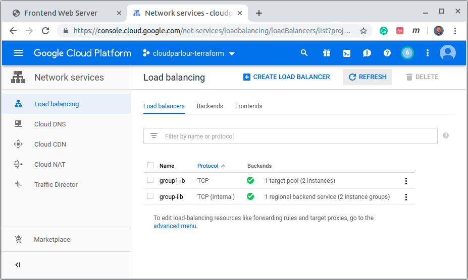
* Click on **group-ilb** load balancer and check the details.
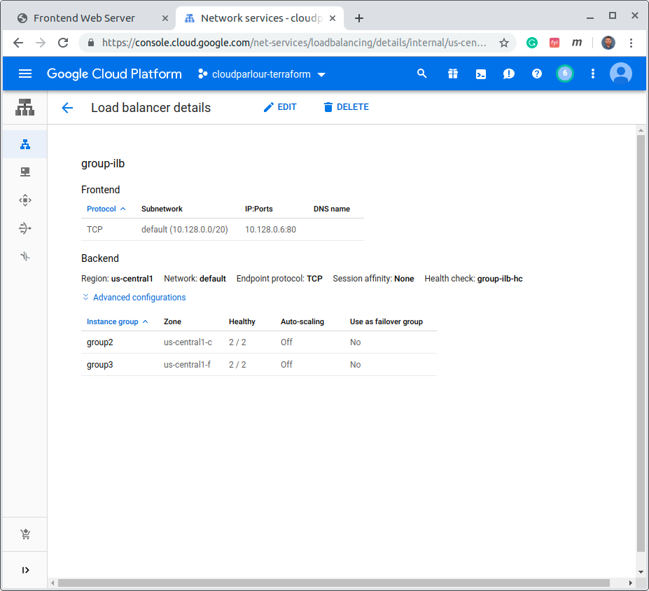


Open the link in a new browser tab. It can take several minutes for the forwarding rule to be provisioned. 

You should see a page like this:

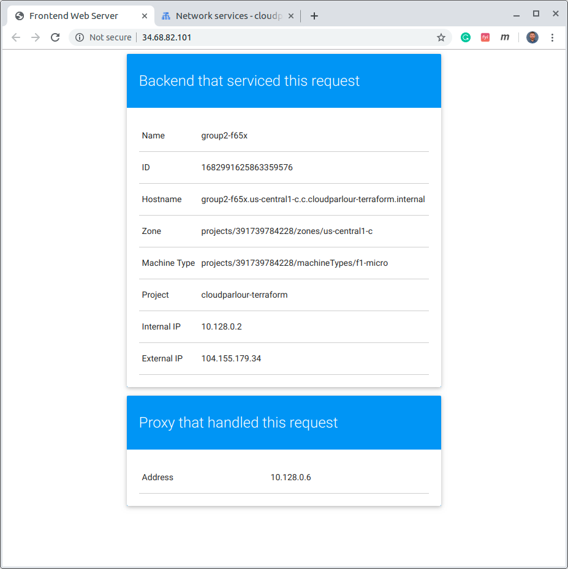

When finished, clean up the example by running `terraform destroy` and change back to the parent directory:

```bash
terraform destroy -auto-approve
cd ..

```

Example Output:
```
...

Destroy complete! Resources: 27 destroyed.

```


terraform-google-lb-http


## Global HTTPS Content-Based Load Balancer

This example creates an HTTPS load balancer to forward traffic to a custom URL map. The URL map sends traffic to the region closest to you with static assets being served from a Cloud Storage bucket. The TLS key and certificate is generated by Terraform using the [TLS provider](https://www.terraform.io/docs/providers/tls/index.html).

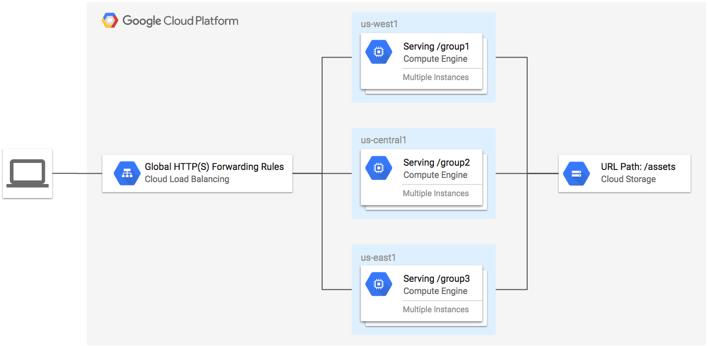

**Figure 1.** `global-https-content-lb` architecture diagram


[Global HTTP Load Balancer Terraform Module](https://github.com/GoogleCloudPlatform/terraform-google-lb-http/) of GCP is used in this tutorial. 


**Figure 2.** `global-https-content-lb` module Terraform resources diagram

* [google_compute_global_forwarding_rule.http](https://www.terraform.io/docs/providers/google/r/compute_global_forwarding_rule.html): The global HTTP forwarding rule.
* [google_compute_global_forwarding_rule.https](https://www.terraform.io/docs/providers/google/r/compute_global_forwarding_rule.html): The global HTTPS forwarding rule created when ssl is true.
* [google_compute_target_http_proxy.default](https://www.terraform.io/docs/providers/google/r/compute_target_http_proxy.html): The HTTP proxy resource that binds the url map. Created when input ssl is false.
* [google_compute_target_https_proxy.default](https://www.terraform.io/docs/providers/google/r/compute_target_https_proxy.html): The HTTPS proxy resource that binds the url map. Created when input ssl is true.
* [google_compute_ssl_certificate.default](https://www.terraform.io/docs/providers/google/r/compute_ssl_certificate.html): The certificate resource created when input ssl is true.
* [google_compute_url_map.default](https://www.terraform.io/docs/providers/google/r/compute_url_map.html): The default URL map resource when input url_map is not provided.
* [google_compute_backend_service.default.*](https://www.terraform.io/docs/providers/google/r/compute_backend_service.html): The backend services created for each of the backend_params elements.
* [google_compute_http_health_check.default.*](https://www.terraform.io/docs/providers/google/r/compute_http_health_check.html): Health check resources create for each of the backend services.
* [google_compute_firewall.default-hc](https://www.terraform.io/docs/providers/google/r/compute_firewall.html): Firewall rule created for each of the backed services to alllow health checks to the instance group.

### Set up the environment

Go into the `https-content-lb` directory

```bash
cd example-lb-https-content
```

### Run Terraform
The terraform init command is used to initialize a working directory containing Terraform configuration files. This command performs several different initialization steps in order to prepare a working directory for use. This command is always safe to run multiple times, to bring the working directory up to date with changes in the configuration.

Run the command:
```bash
terraform init
```

Example Output:
```
Initializing modules...
- module.gce-lb-https
  Getting source "../modules/common-lb"
- module.mig1
  Found version 1.1.14 of GoogleCloudPlatform/managed-instance-group/google on registry.terraform.io
  Getting source "GoogleCloudPlatform/managed-instance-group/google"
- module.mig2
- module.mig3

Initializing provider plugins...
- Checking for available provider plugins on https://releases.hashicorp.com...
- Downloading plugin for provider "google" (1.18.0)...
- Downloading plugin for provider "template" (2.1.2)...
- Downloading plugin for provider "null" (2.1.2)...
- Downloading plugin for provider "random" (2.1.2)...
- Downloading plugin for provider "tls" (2.0.1)...

The following providers do not have any version constraints in configuration,
so the latest version was installed.

To prevent automatic upgrades to new major versions that may contain breaking
changes, it is recommended to add version = "..." constraints to the
corresponding provider blocks in configuration, with the constraint strings
suggested below.

* provider.null: version = "~> 2.1"
* provider.random: version = "~> 2.1"
* provider.template: version = "~> 2.1"
* provider.tls: version = "~> 2.0"

Terraform has been successfully initialized!

You may now begin working with Terraform. Try running "terraform plan" to see
any changes that are required for your infrastructure. All Terraform commands
should now work.

If you ever set or change modules or backend configuration for Terraform,
rerun this command to reinitialize your working directory. If you forget, other
commands will detect it and remind you to do so if necessary.
```

The terraform plan command is used to create an execution plan. Terraform performs a refresh, unless explicitly disabled, and then determines what actions are necessary to achieve the desired state specified in the configuration files. This command is a convenient way to check whether the execution plan for a set of changes matches your expectations without making any changes to real resources or to the state. For example, terraform plan might be run before committing a change to version control, to create confidence that it will behave as expected.

Run the command:

```bash
terraform plan -out=tfplan
```

Example Output:

```
Refreshing Terraform state in-memory prior to plan...
The refreshed state will be used to calculate this plan, but will not be
persisted to local or remote state storage.

data.template_file.group3-startup-script: Refreshing state...
data.template_file.group2-startup-script: Refreshing state...
data.google_compute_zones.available: Refreshing state...
data.google_compute_zones.available: Refreshing state...
data.google_compute_zones.available: Refreshing state...
data.template_file.group1-startup-script: Refreshing state...

------------------------------------------------------------------------

An execution plan has been generated and is shown below.
Resource actions are indicated with the following symbols:
  + create
  ...
  ...
  ...
  + google_compute_backend_bucket.assets
  ...
  + google_compute_network.default
  ...
  + google_compute_subnetwork.group1
  ...
  + google_compute_subnetwork.group2
  ...
  + google_compute_subnetwork.group3
  ...
  + google_compute_url_map.https-content
  ...
  + google_storage_bucket.assets
  ...
  + google_storage_bucket_object.image
  ...
  + google_storage_object_acl.image-acl
  ...
  + random_id.assets-bucket
  ...
  + tls_private_key.example
  ...
  + tls_self_signed_cert.example
  ...
  + module.gce-lb-https.google_compute_backend_service.default[0]
  ...
  + module.gce-lb-https.google_compute_backend_service.default[1]
  ...
  + module.gce-lb-https.google_compute_backend_service.default[2]
  ...
  + module.gce-lb-https.google_compute_backend_service.default[3]
  ...
  + module.gce-lb-https.google_compute_firewall.default-hc[0]
  ...
  + module.gce-lb-https.google_compute_firewall.default-hc[1]
  ...
  + module.gce-lb-https.google_compute_firewall.default-hc[2]
  ...
  + module.gce-lb-https.google_compute_firewall.default-hc[3]
  ...
  + module.gce-lb-https.google_compute_global_address.default
  ...
  + module.gce-lb-https.google_compute_global_forwarding_rule.http
  ...
  + module.gce-lb-https.google_compute_global_forwarding_rule.https
  ...
  + module.gce-lb-https.google_compute_http_health_check.default[0]
  ...
  + module.gce-lb-https.google_compute_http_health_check.default[1]
  ...
  + module.gce-lb-https.google_compute_http_health_check.default[2]
  ...
  + module.gce-lb-https.google_compute_http_health_check.default[3]
  ...
  + module.gce-lb-https.google_compute_ssl_certificate.default
  ...
  + module.gce-lb-https.google_compute_target_http_proxy.default
  ...
  + module.gce-lb-https.google_compute_target_https_proxy.default
  ...
  + module.mig1.google_compute_firewall.default-ssh
  ...
  + module.mig1.google_compute_firewall.mig-health-check
  ...
  + module.mig1.google_compute_health_check.mig-health-check
  ...
  + module.mig1.google_compute_instance_group_manager.default
  ...
  + module.mig1.google_compute_instance_template.default
  ...
  + module.mig1.null_resource.dummy_dependency
  ...
  + module.mig2.google_compute_firewall.default-ssh
  ...
  + module.mig2.google_compute_firewall.mig-health-check
  ...
  + module.mig2.google_compute_health_check.mig-health-check
  ...
  + module.mig2.google_compute_instance_group_manager.default
  ...
  + module.mig2.google_compute_instance_template.default
  ...
  + module.mig2.null_resource.dummy_dependency
  ...
  + module.mig3.google_compute_firewall.default-ssh
  ...
  + module.mig3.google_compute_firewall.mig-health-check
  ...
  + module.mig3.google_compute_health_check.mig-health-check
  ...
  + module.mig3.google_compute_instance_group_manager.default
  ...
  + module.mig3.google_compute_instance_template.default
  ...
  + module.mig3.null_resource.dummy_dependency
  ...
  ...
  ...
  
Plan: 48 to add, 0 to change, 0 to destroy.

------------------------------------------------------------------------

This plan was saved to: tfplan

To perform exactly these actions, run the following command to apply:
    terraform apply "tfplan"

```

The `terraform apply` command is used to apply the changes required to reach the desired state of the configuration, or the pre-determined set of actions generated by a terraform plan execution plan.

Run the following command:

```bash
terraform apply tfplan
```

Example Output:
```
...
...

Apply complete! Resources: 48 added, 0 changed, 0 destroyed.

Outputs:

asset-url = https://34.98.69.45/assets/gcp-logo.svg
group1_region = us-west1
group2_region = us-central1
group3_region = us-east1
load-balancer-ip = 34.98.69.45
```

Run this command to get load balancer external IP and build the URL of the load balancer
```bash
echo https://$(terraform output | grep load-balancer-ip | cut -d = -f2 | xargs echo -n)
```

Your IP adress will be different. Example Output:
```
https://34.98.69.45/
```

Verify resources created by Terraform:

* In the Cloud Console left menu navigate to **Network Services > Load Balancing**
* Wait until you see thee green check mark in the **Backends** column.
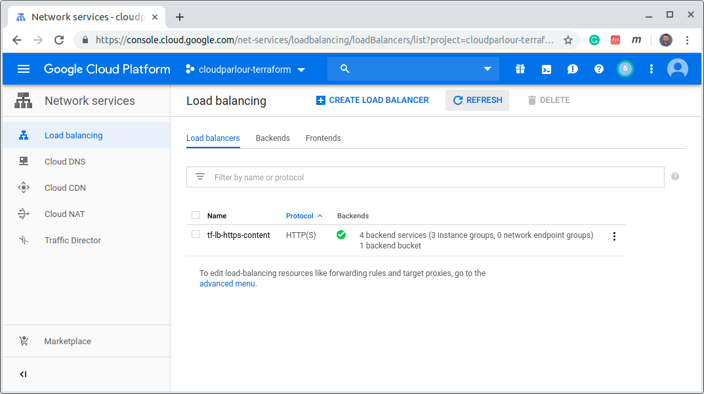
* Click on **tf-lb-https-content** load balancer and check the details.
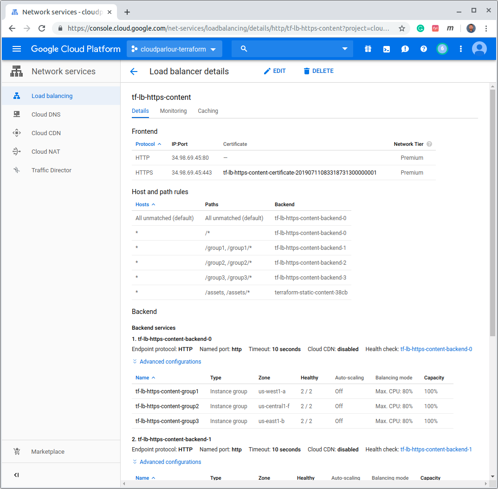


Open the link in a new browser tab. It can take several minutes for the forwarding rule to be provisioned. 

You should see a page like this:

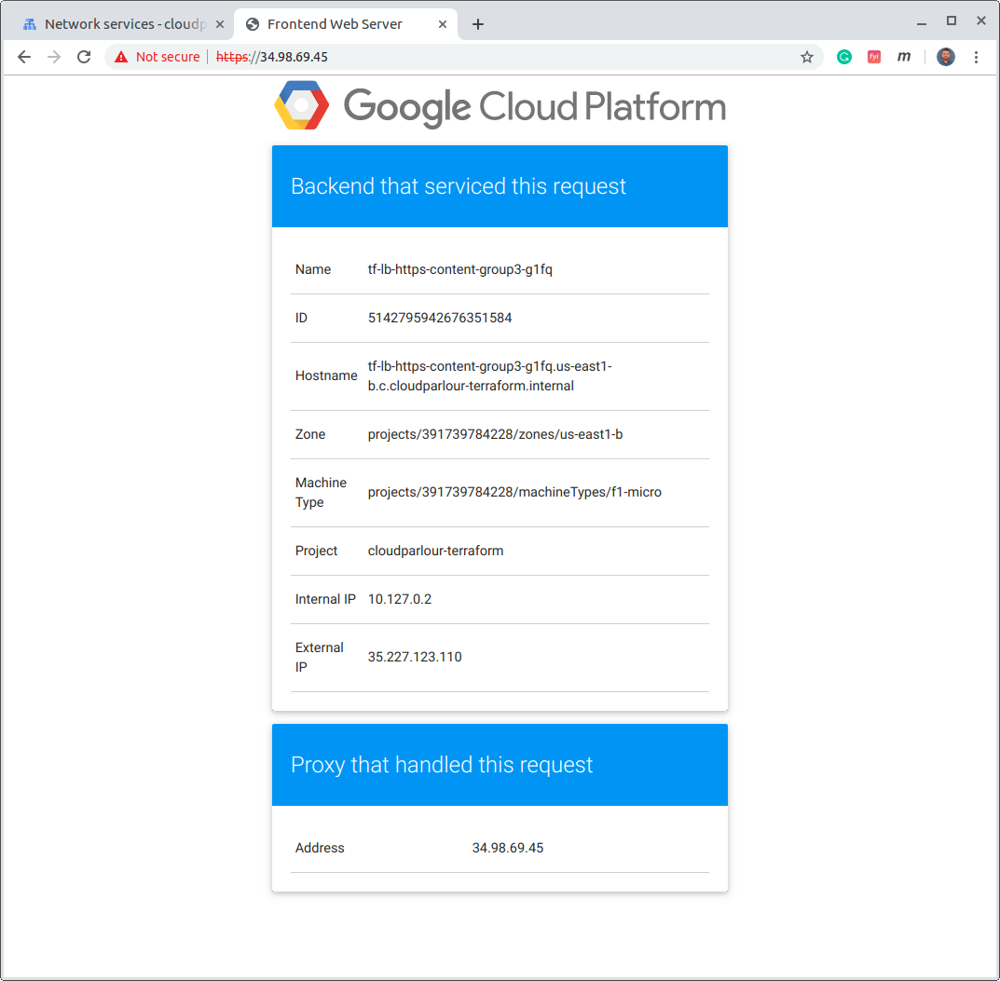

You can access the per-region routes directly through the URLs below:

```bash
echo https://$(terraform output | grep load-balancer-ip | cut -d = -f2 | xargs echo -n)/group1/
echo https://$(terraform output | grep load-balancer-ip | cut -d = -f2 | xargs echo -n)/group2/
echo https://$(terraform output | grep load-balancer-ip | cut -d = -f2 | xargs echo -n)/group3/
```


When finished, clean up the example by running `terraform destroy` and change back to the parent directory:

```bash
terraform destroy -auto-approve
cd ..

```

Example Output:
```
...

Destroy complete! Resources: 48 destroyed.

```